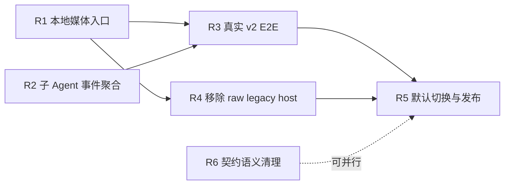

# v2 升级剩余工作

本文记录 Kimi Code CLI 从 legacy 引擎迁移到 agent-core-v2 后尚未完成的工作，用作实现、验收和发布切换的统一清单。结论以 `agent/v2-upgrade` 分支的 `3a59c7c4` 为基线，代码事实优先于历史设计说明。

## 当前状态

交互式 TUI 已经能够通过 `KIMI_CODE_EXPERIMENTAL_FLAG=1` 运行在 v2 Runtime 上，进程级和会话级能力也已经收敛到 runtime-neutral port。当前状态可以概括为：

- **架构迁移完成度约 90%**：v2 生产入口、Klient contract、双 adapter、TUI runtime composition 和两条事件消费链均已接通。
- **功能语义对齐约 80%**：普通文本交互、会话生命周期、配置、认证、插件、扩展命令、目标队列、专家团队和回放已经具备 v2 路径。
- **默认发布准备度约 70%～75%**：仍缺本地媒体、子 Agent 实时事件、真实交互式 E2E 和默认切换前的稳定性验证。

以下事项已经完成，不应在后续任务中重复实现：

- `createKlientTUIRuntime` 已由交互式 v2 runner 生产调用，不再是仅测试可达的代码。
- `/fork`、动态插件命令、`/reload`、认证、配置、模型、实验开关、MCP、Skill 和 extension command 已迁移到 runtime port。
- session title 会在 Klient `metadata.changed` 后回读并更新终端标题。
- expert-team 事件已经投影为 TUI 使用的扁平 snapshot。
- `agentGoalContract`、`sessionCronContract`、`sessionExtensionContract` 和 `agentExtensionContract` 已有编译期 parity 断言。
- TUI 事件面已拆成 `sessionEvents` 和 `agentEvents` 两条独立消费链，deprecated combined port、类型和工厂已经删除。

## 剩余工作总览

| 编号 | 优先级 | 模块 | 性质 | 预计工作量 | 前置依赖 |
| --- | --- | --- | --- | --- | --- |
| R1 | P0 | 本地媒体入口 | 功能阻塞 | 2～3 人日 | 无 |
| R2 | P0 | 子 Agent 实时事件聚合 | 功能缺口 | 1～2 人日 | 无 |
| R3 | P0 | 真实 v2 交互式 E2E | 发布门槛 | 2～4 人日 | R1、R2 |
| R4 | P1 | 移除 TUI raw legacy host | 架构收口 | 1～2 人日 | R1 |
| R5 | P1 | 默认切换、遥测与回滚 | 发布收口 | 1～2 人日，另加观察周期 | R3、R4 |
| R6 | P2 | 跨引擎契约语义清理 | 技术债 | 0.5～1 人日 | 可并行 |

推荐依赖顺序：



## R1：完成本地媒体入口

### 当前问题

TUI 粘贴视频时会把缓存副本编码成 `file://` 类型的 `video_url`。legacy 引擎能够在 turn 内解析这个本地引用，但 v2 的 `AgentVideoResolverService` 只处理 `kimi-file://`，Klient prompt adapter 当前会原样透传 `file://`。

因此 v2 下普通 prompt 和 Ctrl-S steer 携带的本地视频会直接进入 provider 层。部分 provider 无法读取本地文件，OpenAI Responses 路径还会省略无法处理的视频内容。

图片路径也存在两个语义差异：

- v2 TUI 没有 legacy harness，粘贴压缩不会读取 v2 `[image].max_edge_px`。
- ~~压缩后的原图会写入共享临时目录，而不是当前 session 的 `media-originals`。~~（engine 侧已修复：`persistOriginalImage` 现在通过 `IHostFileSystem` 端口写入，调用方传入 session 的 `media-originals` 目录；TUI 侧仍需 R1 的 host capability 把该目录接到粘贴压缩路径上。）

相关代码：

- [`apps/kimi-code/src/tui/utils/image-placeholder.ts`](../src/tui/utils/image-placeholder.ts)
- [`apps/kimi-code/src/tui/controllers/editor-keyboard.ts`](../src/tui/controllers/editor-keyboard.ts)
- [`apps/kimi-code/src/tui/runtime/klient-session-control-adapter.ts`](../src/tui/runtime/klient-session-control-adapter.ts)
- [`packages/node-sdk/src/v2/runtime.ts`](../../../packages/node-sdk/src/v2/runtime.ts)
- [`packages/agent-core-v2/src/agent/media/videoResolverService.ts`](../../../packages/agent-core-v2/src/agent/media/videoResolverService.ts)

### 目标设计

媒体导入属于 host 到 engine 的边界，不应把文件服务、DI accessor 或 agent-core-v2 对象暴露给 TUI。`KimiV2Runtime` 应提供一个窄的 host capability，例如：

```ts
interface KimiV2LocalMedia {
  importVideo(input: {
    path: string;
    mimeType: string;
    filename: string;
  }): Promise<{
    id: string;
    url: string;
  }>;
}
```

该能力内部负责保存文件并生成 `kimi-file://`，TUI 只负责在 prompt/steer 边界把本地 `file://` 转换为 engine 可识别的引用。不要新增包含 session、图片、视频、配置和文件服务的 media god port。

图片配置和原图持久化应通过同一窄边界补齐，但保持能力拆分：

- 读取当前有效的图片最长边配置。
- 将原图保存到当前 session 的 `media-originals`。
- TUI 继续拥有 placeholder、编辑器状态和压缩提示文案。

### 实现清单

- [ ] 在 node-sdk v2 runtime 暴露窄 `localMedia` capability。
- [ ] 使用 v2 文件服务保存视频并生成 `kimi-file://`。
- [ ] 在 Klient session control adapter 中为 prompt 和 steer 共用异步媒体转换。
- [ ] 让 v2 图片压缩读取 `[image].max_edge_px`。
- [ ] 让 v2 压缩原图进入 session `media-originals`。
- [ ] 保留 data URL 图片的现有行为。
- [ ] 增加 node-sdk runtime、session control adapter 和 TUI 媒体回归测试。

### 验收标准

- v1 和 v2 均能从剪贴板发送图片和视频。
- v2 provider 收到的本地视频不包含 `file://`。
- prompt 与 steer 使用同一媒体转换路径。
- 不支持视频输入的模型得到可读降级文本，而不是静默丢失内容。
- v2 图片压缩遵循配置，原图路径跟随 session 生命周期。

## R2：聚合 v2 子 Agent 实时事件

### 当前问题

两条消费链已经拆分，但 `agentEvents` 的双 adapter 语义仍不完全一致：

- legacy 使用 `createLegacySessionAgentEventsPort`，会接收同一 session 下所有 Agent 的实时事件。
- Klient composition 使用 `createKlientAgentEventsPort`，只订阅一个固定的 `session.agent(agentId)`。
- Klient adapter 会把输出事件的 `agentId` 固定成绑定 Agent，无法把真实子 Agent 事件交给 `SubAgentEventHandler`。

这不会阻止主 Agent 完成 turn，但会导致 v2 下子 Agent 的 thinking、assistant delta、工具调用和工具进度无法完整更新嵌套面板。

相关代码：

- [`apps/kimi-code/src/tui/runtime/klient-agent-events-adapter.ts`](../src/tui/runtime/klient-agent-events-adapter.ts)
- [`apps/kimi-code/src/tui/runtime/tui-session-runtime.ts`](../src/tui/runtime/tui-session-runtime.ts)
- [`apps/kimi-code/src/tui/controllers/subagent-event-handler.ts`](../src/tui/controllers/subagent-event-handler.ts)
- [`packages/klient/src/core/facade/session.ts`](../../../packages/klient/src/core/facade/session.ts)

### 目标设计

新增 session-rooted Klient Agent 事件适配器，其职责仅是维护当前 session 的 Agent 订阅集合：

- root agent 决定 replay 读取对象。
- live subscription 覆盖 root agent 及其运行期间创建的子 Agent。
- 每条事件保留真实 `agentId`。
- Agent 被移除或整个 port 无 listener 时释放对应订阅。

不要让 `SessionEventHandler` 自己扫描 `session.agents()`，也不要让 UI controller 持有 Klient facade。动态订阅属于 adapter/composition 边界。

### 实现清单

- [ ] 新增 `createKlientSessionAgentEventsPort`。
- [ ] 初始读取 `session.agents()` 并订阅现有 Agent。
- [ ] 在 session metadata 的 `agents` 变化后增量同步订阅。
- [ ] 保留每条事件的真实 `agentId`。
- [ ] replay 只读取 root agent。
- [ ] 在 `createKlientTUISessionRuntime` 中替换固定 Agent adapter。
- [ ] 增加动态新增、移除、重复通知和 dispose 测试。

### 验收标准

- v2 主 Agent 和子 Agent 事件都进入同一个 `agentEvents` 消费链。
- 子 Agent 输出能够更新 Agent/AgentSwarm 嵌套面板。
- session 切换后旧 Agent 事件不能落入新 session。
- legacy 和 Klient 两侧满足同一 `AgentEventsPort` 行为契约。

## R3：建立真实 v2 交互式 E2E

### 当前问题

现有测试已经覆盖 contract、facade、adapter、runtime composition 和大量 TUI message-flow，但交互式 v2 runner 的测试仍以 mock 为主。缺少真实 `createKimiV2Runtime`、真实 Klient memory transport 和终端输入输出组合起来的端到端验证。

### 实现清单

- [ ] 建立可重复运行的 v2 interactive test harness。
- [ ] 覆盖新建、恢复、切换、fork 和关闭 session。
- [ ] 覆盖 prompt、steer、cancel 和 queued message。
- [ ] 覆盖 approval 与 question reverse RPC。
- [ ] 覆盖 `/model`、`/effort`、`/reload`、插件和 extension command。
- [ ] 覆盖目标队列、专家团队、子 Agent 和 AgentSwarm。
- [ ] 覆盖图片、视频以及不支持媒体模型的降级行为。
- [ ] 覆盖正常退出、SIGTERM、启动失败和 runtime close。
- [ ] 增加一轮长 session replay 与多次 session switch 稳定性测试。

### 验收标准

- E2E 不依赖 legacy `KimiHarness` 或 raw `Session`。
- 相同场景在 v1/v2 下的用户可见行为一致，明确列出的差异除外。
- 测试能够发现 stale subscription、资源未关闭和 session 绑定串线。
- CI 中至少有一条真实 v2 interactive smoke path。

## R4：移除 TUI 的 raw legacy host

### 当前问题

业务命令已经迁移到 runtime port，但兼容类型仍留在 TUI host：

- `KimiTUI` 继续保存 `this.session` 和 `this.harness`。
- `ActiveSessionBinding` 仍包含 `legacySession`。
- `EditorKeyboardHost` 直接暴露 raw `Session/KimiHarness` 以读取媒体配置和 session 目录。
- `SlashCommandHost` 仍声明未被命令使用的 `session`、`harness`、`requireSession()`、raw `switchToSession()` 和双参数 `sendQueuedMessage()`。
- resume warning 仍有直接读取 `Session.getResumeState()` 的 legacy 支路。

相关代码：

- [`apps/kimi-code/src/tui/kimi-tui.ts`](../src/tui/kimi-tui.ts)
- [`apps/kimi-code/src/tui/controllers/editor-keyboard.ts`](../src/tui/controllers/editor-keyboard.ts)
- [`apps/kimi-code/src/tui/commands/dispatch.ts`](../src/tui/commands/dispatch.ts)

### 目标设计

`KimiTUI` 只接收 `TUIRuntime`，legacy harness 在 CLI composition root 中被包装成 `createLegacyTUIRuntime`。raw SDK 对象只能存在于 `legacy-*-adapter.ts` 及其测试夹具中。

### 实现清单

- [ ] 完成 R1 后，从 `EditorKeyboardHost` 移除 `Session/KimiHarness`。
- [ ] 把 resume warning 归一到 `SessionWarningsPort` 或明确的 replay contract。
- [ ] 删除 `ActiveSessionBinding.legacySession`。
- [ ] 删除 `KimiTUI.session`、`KimiTUI.harness` 和 legacy identity 转换入口。
- [ ] 删除 `setSession(Session)`、raw `switchToSession(Session)` 兼容方法。
- [ ] 删除双参数 `sendQueuedMessage(Session, item)`。
- [ ] 从 `SlashCommandHost` 删除所有 raw legacy 成员。
- [ ] 在 legacy CLI runner 中显式构造并传入 `TUIRuntime`。
- [ ] 更新测试夹具，使其只构造 runtime 和中立 identity。

### 验收标准

- `apps/kimi-code/src/tui` 的非 legacy adapter 代码不再导入 `KimiHarness` 或 `Session`。
- `KimiTUI` 构造函数不再接受 raw harness。
- v1 继续通过 legacy composition 正常运行。
- v2 不再依赖 `undefined` harness 带来的隐式 fallback。

## R5：完成默认切换、遥测和回滚

### 当前问题

交互式 v2 已经是生产可达路径，但 [`apps/kimi-code/src/cli/run-shell.ts`](../src/cli/run-shell.ts) 仍通过 `KIMI_CODE_EXPERIMENTAL_FLAG` 选择 v2，默认路径继续创建 legacy harness。

v2 print runner 会记录 `exit` telemetry，交互式 v2 shell 目前只记录 `startup_perf`。`KimiTUI.stop()` 会在 `onExit` 前关闭 runtime，因此退出事件必须在 runtime close 之前记录，不能简单补在现有 `runV2Shell.onExit` 中。

### 实现清单

- [ ] 在 runtime close 前记录 v2 interactive `exit` telemetry。
- [ ] 对比 v1/v2 的启动、退出、异常和遥测字段。
- [ ] 运行 R3 的完整回归与稳定性测试。
- [ ] 将 v2 调整为默认 interactive engine。
- [ ] 保留明确的强制 v1 回退入口，用于线上回滚。
- [ ] 更新 CLI 错误提示、实验开关说明和发布文档。
- [ ] 观察 session 恢复失败、provider 错误、MCP 启动和 crash 指标。
- [ ] 稳定后再删除 legacy 默认入口，而不是与默认切换同时删除。

### 验收标准

- 无环境变量时交互式 CLI 默认使用 v2。
- 用户可以显式回退到 v1，且回退路径经过测试。
- 正常退出、异常退出和 `/web` 前台接管不会泄漏 runtime 资源。
- 发布指标能够区分 v1/v2，并支持按引擎定位回归。

## R6：收口跨引擎契约语义

这些问题不是发布阻塞项，但应在默认切换前明确，避免兼容层继续扩散。

### 实现清单

- [ ] 将无人消费返回值的 `SessionContextControlPort.compact()` 收窄为 `Promise<void>`，或补充真实的布尔语义。
- [ ] 删除没有生产消费方的 `TUIAgentReplay.warning`，或把 warning 明确接入统一 warning 展示。
- [ ] 明确 `AgentEventsPort.readReplay()` 返回 `undefined` 的跨引擎含义，并覆盖 legacy 无历史与 v2 空历史。
- [ ] 给 expert-team 状态的双引擎超集补充 adapter 注释和契约测试，避免把 v2 不产生的状态误认为运行时分支。
- [ ] 删除完成 R4 后剩余的兼容 overload 和死分支。

### 验收标准

- port 的返回值都被消费方使用，或明确声明为 `void`。
- legacy 与 Klient 的差异只存在于 adapter 内。
- controller 不包含仅对单一引擎成立且没有注释的死分支。

## 推荐实施批次

### 批次一：功能对齐

并行完成 R1 和 R2。这两个任务修改的核心文件不同，分别集中在媒体边界和 Agent 事件 adapter，可以独立开发与验证。

完成标准：v2 交互式 TUI 的本地媒体和子 Agent 实时展示不再弱于 v1。

### 批次二：架构与回归

以 R1 为前置完成 R4，同时开始 R3 的非媒体场景；R1、R2 落地后补全媒体和子 Agent E2E。

完成标准：TUI 非 legacy adapter 代码不再持有 raw SDK 对象，并有真实 v2 interactive smoke test。

### 批次三：发布切换

完成 R5，并把 R6 中风险较低的契约清理纳入同一轮回归。默认切换和 legacy 删除必须分成两个可回滚步骤。

完成标准：v2 默认启用、v1 可强制回退、关键指标可区分引擎，经过至少一个观察周期后再评估删除 legacy engine。

## 总体工作量

- **修复核心功能缺口并继续保留实验开关**：约 4～6 人日。
- **达到可以默认替换 v1 的发布标准**：约 8～12 人日。
- **建议日历周期**：包含联调、CI 和稳定性观察约 2～3 周。

工作量不包括 provider 本身的外部故障、线上观察等待时间，以及默认切换后才决定执行的 legacy engine 删除。
