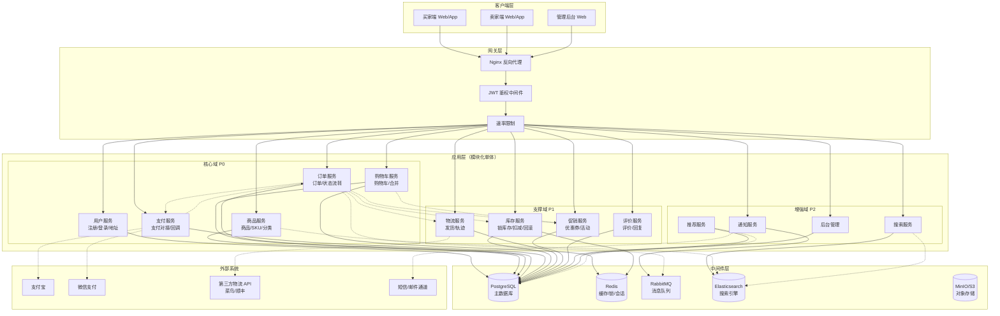
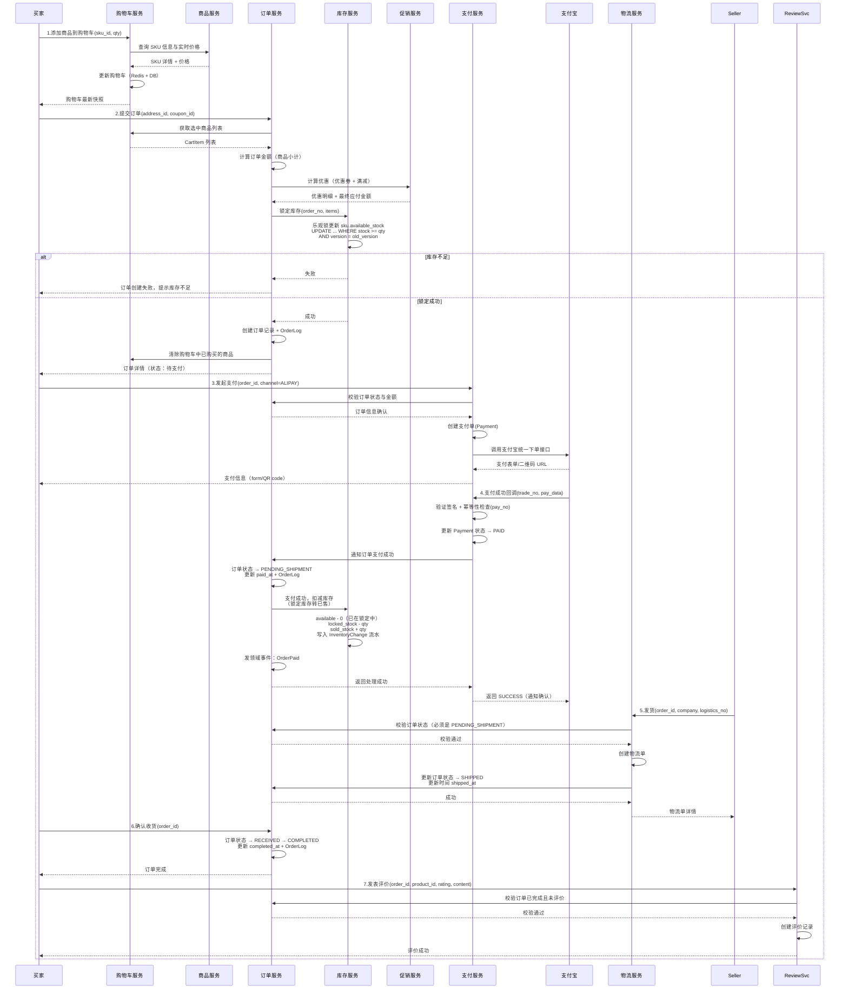
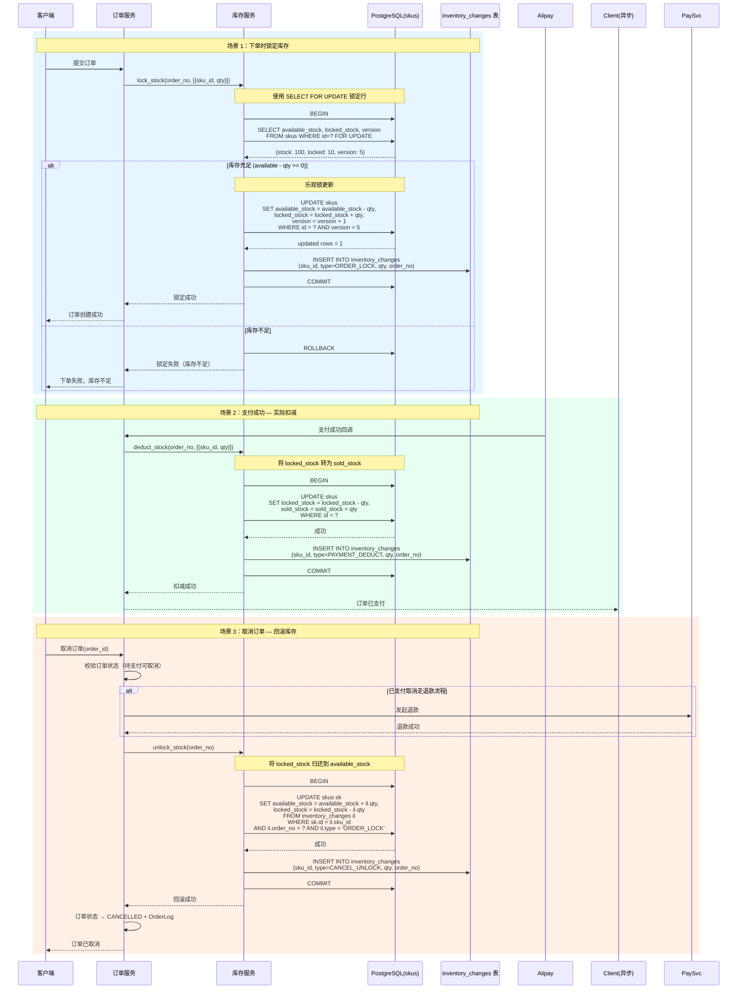
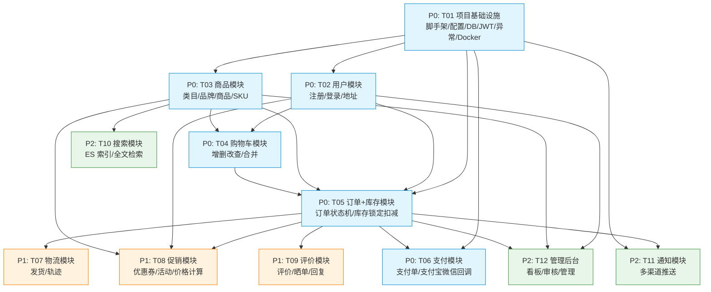

# 购物平台后端系统 — 系统架构设计与任务分解

> **版本**: 1.0
> **作者**: Bob (Software Architect)
> **状态**: Draft
> **基于 PRD**: `shopping-prd.md` (v1.0)

---

## Part A: 系统设计

---

### 1. 实现方案与框架选型

#### 1.1 架构风格：模块化单体（Modular Monolith）

**推荐选择：模块化单体，预留微服务拆分路径**

| 对比维度 | 模块化单体 | 微服务（初期） |
|---------|-----------|--------------|
| 交付速度 | 快 — 一个应用启动即可 | 慢 — 基础设施、服务发现、CI/CD 管线 |
| 数据一致性 | 强 — 本地事务即可保证 | 弱 — 需要 Saga/TCC 等分布式事务 |
| 团队规模 | 适合 3–8 人团队 | 适合 8+ 人 / 多团队 |
| 部署复杂度 | 低 — 单进程部署 | 高 — 多服务编排、监控 |
| 后期演进 | 按模块边界拆分 | 已经是微服务 |

**理由**：当前阶段需求集中于核心交易链路（P0），模块间存在大量事务性协同（订单 + 库存 + 支付），模块化单体在保证 ACID 的前提下交付效率最高，同时通过严格的包边界和依赖倒置设计，为后续微服务拆分保留清晰的 seam（接缝）。

#### 1.2 技术栈选型

| 层级 | 技术选型 | 版本 | 说明 |
|------|---------|------|------|
| **后端语言** | Python | 3.11+ | 生态成熟，开发效率高，适合电商业务 CRUD + I/O 密集场景 |
| **Web 框架** | FastAPI | 0.104+ | 异步原生，性能优异，Pydantic 集成自动校验 + OpenAPI 文档 |
| **ORM** | SQLAlchemy 2.0 | 2.0+ | 成熟的异步 ORM，支持声明式映射、工作单元模式 |
| **数据库迁移** | Alembic | 1.12+ | SQLAlchemy 官方迁移工具，与 ORM 模型紧密绑定 |
| **主数据库** | PostgreSQL | 15+ | ACID 强一致，支持 JSONB 灵活属性、行级锁（SELECT FOR UPDATE） |
| **缓存 / 会话** | Redis | 7+ | 购物车缓存、分布式锁（RedLock）、会话存储、秒杀计数器 |
| **消息队列** | RabbitMQ | 3.12+ | 可靠的消息投递，用于订单事件（非关键路径，基于事务发件箱模式） |
| **搜索引擎** | Elasticsearch | 8.x | 商品全文检索（P2 功能，初期可后接） |
| **认证方案** | JWT（access + refresh token） | — | 无状态认证，降低服务耦合 |
| **对象存储** | MinIO / AWS S3 | — | 商品图片、评价图片存储 |
| **API 文档** | 内置 Swagger / Redoc | — | FastAPI 自动生成 |
| **任务队列** | Celery + Redis Broker | — | 异步任务（物流轨迹刷新、优惠券过期） |
| **测试** | pytest + pytest-asyncio | — | 单元测试 + 集成测试 + 测试容器 |

#### 1.3 整体架构图



> **注**：在模块化单体中，服务间调用为进程内方法调用（Python 函数/类调用），通过依赖注入和 Repository 模式解耦。上图中的服务间虚线表示逻辑依赖关系。

---

### 2. 文件列表与项目目录结构

```
shopping-platform/
├── pyproject.toml                # 项目依赖与构建配置（Poetry / PDM）
├── alembic.ini                   # Alembic 迁移配置
├── docker-compose.yml            # 本地开发环境编排（PG + Redis + RabbitMQ + ES）
├── Dockerfile                    # 应用容器化
├── .env.example                  # 环境变量模板
├── Makefile                      # 常用命令集合
│
├── alembic/                      # 数据库迁移脚本
│   ├── env.py
│   ├── script.py.mako
│   └── versions/
│
├── config/                       # 应用配置
│   ├── __init__.py
│   ├── settings.py               # Pydantic Settings（BaseSettings）
│   └── logger.py                 # 日志配置
│
├── common/                       # 跨模块共享基础设施
│   ├── __init__.py
│   ├── base/                     # 基础类
│   │   ├── repository.py         # BaseRepository（CRUD 抽象）
│   │   ├── service.py            # BaseService（业务编排抽象）
│   │   ├── schema.py             # BaseSchema（Pydantic 模型基类）
│   │   └── model.py              # BaseModel（SQLAlchemy 声明式基类）
│   ├── exceptions/               # 全局异常体系
│   │   ├── __init__.py
│   │   ├── base.py               # AppException（基类）
│   │   ├── error_code.py         # 错误码枚举
│   │   └── handlers.py           # FastAPI 异常处理器
│   ├── security/                 # 安全与认证
│   │   ├── jwt.py                # JWT 生成/验证
│   │   ├── password.py           # 密码哈希（bcrypt）
│   │   └── deps.py               # FastAPI 依赖注入（获取当前用户）
│   ├── middleware/               # 中间件
│   │   ├── request_id.py         # 请求追踪 ID
│   │   └── request_log.py        # 请求日志
│   ├── pagination.py             # 分页工具
│   ├── idempotent.py             # 幂等性装饰器
│   └── utils.py                  # 通用工具函数
│
├── domains/                      # 业务域（核心 — 按模块组织）
│   │
│   ├── user/                     # 用户域（P0）
│   │   ├── __init__.py
│   │   ├── models.py             # User, Address ORM 模型
│   │   ├── schemas.py            # UserCreate, UserLogin, AddressCreate 等
│   │   ├── repository.py         # UserRepository, AddressRepository
│   │   ├── service.py            # UserService（注册、登录、地址管理）
│   │   ├── router.py             # FastAPI Router（/api/v1/users）
│   │   └── tests/                # 单元/集成测试
│   │       ├── test_service.py
│   │       └── test_router.py
│   │
│   ├── product/                  # 商品域（P0）
│   │   ├── __init__.py
│   │   ├── models.py             # Category, Brand, Product, SKU, ProductImage
│   │   ├── schemas.py
│   │   ├── repository.py         # ProductRepository, SKURepository
│   │   ├── service.py            # ProductService, SKUService
│   │   ├── router.py             # /api/v1/products, /api/v1/categories
│   │   └── tests/
│   │
│   ├── cart/                     # 购物车域（P0）
│   │   ├── __init__.py
│   │   ├── models.py             # Cart, CartItem
│   │   ├── schemas.py
│   │   ├── repository.py
│   │   ├── service.py            # CartService（合并购物车逻辑在此）
│   │   ├── router.py             # /api/v1/cart
│   │   └── tests/
│   │
│   ├── order/                    # 订单域（P0）
│   │   ├── __init__.py
│   │   ├── models.py             # Order, OrderItem, OrderLog
│   │   ├── schemas.py            # OrderCreate, OrderVO, OrderCancel
│   │   ├── repository.py
│   │   ├── service.py            # OrderService（创建、取消、状态机）
│   │   ├── router.py             # /api/v1/orders
│   │   └── tests/
│   │
│   ├── payment/                  # 支付域（P0）
│   │   ├── __init__.py
│   │   ├── models.py             # Payment, PaymentChannel
│   │   ├── schemas.py
│   │   ├── repository.py
│   │   ├── service.py            # PaymentService（调用外部网关）
│   │   ├── gateway/              # 支付网关适配器
│   │   │   ├── base.py           # AbstractPaymentGateway
│   │   │   ├── alipay.py         # 支付宝实现
│   │   │   └── wechat.py         # 微信支付实现
│   │   ├── router.py             # /api/v1/payments（含回调 endpoint）
│   │   └── tests/
│   │
│   ├── inventory/                # 库存域（P1）
│   │   ├── __init__.py
│   │   ├── models.py             # InventoryChange 流水
│   │   ├── schemas.py
│   │   ├── repository.py
│   │   ├── service.py            # InventoryService（锁/扣/回滚）
│   │   ├── router.py             # /api/v1/inventory（管理员用）
│   │   └── tests/
│   │
│   ├── logistics/                # 物流域（P1）
│   │   ├── __init__.py
│   │   ├── models.py             # Logistics, LogisticsTrack
│   │   ├── schemas.py
│   │   ├── repository.py
│   │   ├── service.py            # LogisticsService
│   │   ├── third_party/          # 第三方物流适配器
│   │   │   └── base.py
│   │   ├── router.py             # /api/v1/logistics
│   │   └── tests/
│   │
│   ├── promotion/                # 促销域（P1）
│   │   ├── __init__.py
│   │   ├── models.py             # Coupon, UserCoupon, Activity, ActivityRule
│   │   ├── schemas.py
│   │   ├── repository.py
│   │   ├── service.py            # PromotionService（优惠计算引擎）
│   │   ├── router.py             # /api/v1/promotions
│   │   └── tests/
│   │
│   ├── review/                   # 评价域（P1）
│   │   ├── __init__.py
│   │   ├── models.py             # Review, ReviewImage, ReviewReply
│   │   ├── schemas.py
│   │   ├── repository.py
│   │   ├── service.py
│   │   ├── router.py             # /api/v1/reviews
│   │   └── tests/
│   │
│   ├── search/                   # 搜索域（P2）
│   │   ├── __init__.py
│   │   ├── indexer.py            # 商品索引构建/同步
│   │   ├── querier.py            # 搜索查询 DSL
│   │   ├── service.py            # SearchService
│   │   └── router.py             # /api/v1/search
│   │
│   ├── notification/             # 通知域（P2）
│   │   ├── __init__.py
│   │   ├── models.py             # Notification, NotificationTemplate
│   │   ├── schemas.py
│   │   ├── service.py            # NotificationService
│   │   ├── channels/             # 通知渠道
│   │   │   ├── base.py
│   │   │   ├── sms.py
│   │   │   └── email.py
│   │   └── router.py             # /api/v1/notifications
│   │
│   └── admin/                    # 后台管理（P2）
│       ├── __init__.py
│       ├── dashboard.py          # 数据看板聚合
│       ├── user_mgmt.py          # 用户管理
│       ├── product_mgmt.py       # 商品审核
│       ├── order_mgmt.py         # 订单管理
│       └── router.py             # /api/v1/admin
│
├── events/                       # 领域事件
│   ├── __init__.py
│   ├── event_bus.py              # 事件总线（基于 RabbitMQ 或内存）
│   ├── handlers/                 # 事件处理器
│   │   ├── order_events.py       # 订单创建/支付成功 → 通知/物流等
│   │   └── payment_events.py     # 支付完成 → 订单状态推进
│   │
│   └── outbox.py                 # 事务发件箱模式实现
│
├── main.py                       # FastAPI 应用入口
│
└── tests/                        # 全局集成测试
    ├── conftest.py               # 共享 fixture（DB session, Redis mock）
    ├── test_cart_flow.py         # 购物车 → 订单 → 支付 端到端
    ├── test_inventory_flow.py    # 库存扣减端到端
    └── test_promotion_flow.py    # 优惠计算端到端
```

---

### 3. 数据结构与接口设计

#### 3.1 核心领域模型（类图）

```mermaid
classDiagram
    %% ========== 基础模型 ==========
    class BaseModel {
        <<abstract>>
        +int id
        +datetime created_at
        +datetime updated_at
    }

    %% ========== 用户域 ==========
    class User {
        +int id
        +str username
        +str password_hash
        +str email
        +str phone
        +UserRole role
        +UserStatus status
        +datetime last_login_at
        +register()
        +login() -> TokenPair
        +refresh_token() -> TokenPair
    }

    class UserRole {
        <<enumeration>>
        BUYER
        SELLER
        ADMIN
    }

    class Address {
        +int id
        +int user_id
        +str province
        +str city
        +str district
        +str detail
        +str receiver_name
        +str receiver_phone
        +bool is_default
    }

    %% ========== 商品域 ==========
    class Category {
        +int id
        +str name
        +int parent_id
        +int level
        +int sort_order
    }

    class Brand {
        +int id
        +str name
        +str logo_url
        +str description
    }

    class Product {
        +int id
        +int category_id
        +int brand_id
        +int shop_id
        +str title
        +str description
        +ProductStatus status
        +str main_image
        +list~str~ images
        +list~SkuVO~ sku_list
        +on_shelf()
        +off_shelf()
        +get_detail() -> ProductDetail
    }

    class ProductStatus {
        <<enumeration>>
        DRAFT
        PENDING_REVIEW
        ON_SHELF
        OFF_SHELF
        REJECTED
    }

    class SKU {
        +int id
        +int product_id
        +str attrs_json  "{\\"颜色\\": \\"红色\\", \\"尺寸\\": \\"M\\"}"
        +Decimal price
        +int available_stock
        +int locked_stock
        +int sold_stock
        +str sku_code
        +str image_url
        +Decimal weight
    }

    %% ========== 购物车域 ==========
    class Cart {
        +int id
        +int user_id
        +list~CartItem~ items
        +add_item(sku_id, quantity)
        +remove_item(sku_id)
        +update_quantity(sku_id, quantity)
        +clear()
        +merge_cart(guest_cart)  "登录时合并"
    }

    class CartItem {
        +int id
        +int cart_id
        +int sku_id
        +int quantity
        +bool selected
    }

    %% ========== 订单域 ==========
    class Order {
        +int id
        +str order_no
        +int user_id
        +int shop_id
        +int address_id
        +OrderStatus status
        +Decimal total_amount
        +Decimal discount_amount
        +Decimal freight_amount
        +Decimal pay_amount
        +str buyer_message
        +datetime paid_at
        +datetime shipped_at
        +datetime completed_at
        +create_from_cart()
        +cancel()
        +pay_success()
        +ship()
        +confirm_receive()
    }

    class OrderStatus {
        <<enumeration>>
        PENDING_PAYMENT
        PENDING_SHIPMENT
        SHIPPED
        RECEIVED
        COMPLETED
        CANCELLED
        REFUNDING
        REFUNDED
    }

    class OrderItem {
        +int id
        +int order_id
        +int sku_id
        +str sku_attrs
        +str product_title
        +str product_image
        +Decimal price
        +int quantity
        +Decimal subtotal
    }

    class OrderLog {
        +int id
        +int order_id
        +OrderStatus from_status
        +OrderStatus to_status
        +str operator
        +str remark
    }

    %% ========== 支付域 ==========
    class Payment {
        +int id
        +str pay_no
        +int order_id
        +Decimal amount
        +PayChannel channel
        +PayStatus status
        +str channel_trade_no
        +datetime paid_at
        +process_callback(channel_data)
    }

    class PayChannel {
        <<enumeration>>
        ALIPAY
        WECHAT_PAY
    }

    class PayStatus {
        <<enumeration>>
        PENDING
        PAID
        FAILED
        REFUNDING
        REFUNDED
    }

    class AbstractPaymentGateway {
        <<interface>>
        +create_payment(order) -> PaymentForm
        +process_callback(data) -> PaymentResult
        +refund(payment) -> RefundResult
        +query_status(pay_no) -> PayStatus
    }

    %% ========== 库存域 ==========
    class InventoryChange {
        +int id
        +int sku_id
        +InventoryChangeType change_type
        +int quantity
        +str order_no
        +str remark
    }

    class InventoryChangeType {
        <<enumeration>>
        ORDER_LOCK
        PAYMENT_DEDUCT
        CANCEL_UNLOCK
        REFUND_RESTORE
        MANUAL_ADJUST
    }

    %% ========== 物流域 ==========
    class Logistics {
        +int id
        +int order_id
        +str company_code
        +str company_name
        +str logistics_no
        +LogisticsStatus status
        +list~LogisticsTrack~ tracks
    }

    class LogisticsTrack {
        +int id
        +int logistics_id
        +str content
        +datetime track_time
    }

    class LogisticsStatus {
        <<enumeration>>
        PENDING_PICKUP
        IN_TRANSIT
        DELIVERED
        SIGNED
    }

    %% ========== 促销域 ==========
    class Coupon {
        +int id
        +str name
        +CouponType type
        +Decimal threshold
        +Decimal discount
        +int total_stock
        +int used_count
        +datetime valid_from
        +datetime valid_until
    }

    class CouponType {
        <<enumeration>>
        FIXED_DISCOUNT     "满 X 减 Y"
        PERCENT_DISCOUNT   "折扣券"
        FREE_SHIPPING      "免运费券"
    }

    class UserCoupon {
        +int id
        +int user_id
        +int coupon_id
        +UserCouponStatus status
        +datetime used_at
        +int order_id
    }

    class UserCouponStatus {
        <<enumeration>>
        UNUSED
        USED
        EXPIRED
    }

    class Activity {
        +int id
        +str name
        +ActivityType type
        +datetime start_time
        +datetime end_time
        +str rule_json  "规则 DSL JSON"
    }

    class ActivityType {
        <<enumeration>>
        FLASH_SALE
        GROUP_BUY
        FULL_REDUCTION
    }

    %% ========== 评价域 ==========
    class Review {
        +int id
        +int user_id
        +int product_id
        +int order_id
        +int rating
        +str content
        +list~str~ images
        +ReviewStatus status
        +ReviewReply reply
    }

    class ReviewReply {
        +int id
        +int review_id
        +str content
    }

    class ReviewStatus {
        <<enumeration>>
        PENDING
        APPROVED
        HIDDEN
    }

    %% ========== 关联关系 ==========
    User "1" --> "N" Address : has
    User "1" --> "N" Order : places
    User "1" --> "1" Cart : owns
    User "1" --> "N" Review : writes
    User "N" --> "N" Coupon : via UserCoupon

    Product "1" --> "1" Category : belongs_to
    Product "1" --> "1" Brand : belongs_to
    Product "1" --> "N" SKU : has

    Cart "1" --> "N" CartItem : contains
    CartItem "1" --> "1" SKU : references

    Order "1" --> "N" OrderItem : contains
    Order "1" --> "N" OrderLog : logs
    OrderItem "1" --> "1" SKU : references

    Payment "N" --> "1" Order : for
    Payment "1" --> "1" AbstractPaymentGateway : uses

    SKU "1" --> "N" InventoryChange : records

    Order "1" --> "1" Logistics : ships_via
    Logistics "1" --> "N" LogisticsTrack : has

    Review "1" --> "1" ReviewReply : has
```

#### 3.2 核心业务 Service 接口

```mermaid
classDiagram
    %% ========== 用户服务 ==========
    class IUserService {
        <<interface>>
        +register(req: RegisterRequest) -> UserVO
        +login(req: LoginRequest) -> TokenPair
        +refresh_token(refresh_token: str) -> TokenPair
        +get_user(user_id: int) -> UserVO
        +update_profile(user_id: int, req: UpdateProfileReq) -> UserVO
        +change_password(user_id: int, req: ChangePwdReq)
        +create_address(user_id: int, req: AddressReq) -> AddressVO
        +list_addresses(user_id: int) -> list~AddressVO~
        +set_default_address(user_id: int, address_id: int)
    }

    %% ========== 商品服务 ==========
    class IProductService {
        <<interface>>
        +create_product(shop_id: int, req: ProductReq) -> ProductVO
        +update_product(product_id: int, req: ProductReq) -> ProductVO
        +get_product_detail(product_id: int) -> ProductDetailVO
        +list_products(category_id: int, page, size) -> Page~ProductVO~
        +on_shelf(product_id: int)
        +off_shelf(product_id: int)
        +add_sku(product_id: int, req: SKUReq) -> SKUVO
        +update_sku(sku_id: int, req: SKUReq) -> SKUVO
        +list_categories() -> list~CategoryVO~
        +list_brands() -> list~BrandVO~
    }

    %% ========== 购物车服务 ==========
    class ICartService {
        <<interface>>
        +add_item(user_id: int, sku_id: int, quantity: int) -> CartVO
        +update_item_quantity(user_id: int, sku_id: int, quantity: int) -> CartVO
        +remove_item(user_id: int, sku_id: int)
        +list_cart(user_id: int) -> CartVO
        +clear_cart(user_id: int)
        +merge_cart(user_id: int, guest_cart_token: str) -> CartVO
        +select_items(user_id: int, sku_ids: list~int~)
        +get_selected_items(user_id: int) -> list~CartItemVO~
    }

    %% ========== 订单服务 ==========
    class IOrderService {
        <<interface>>
        +create_order(user_id: int, req: CreateOrderReq) -> OrderVO
        +get_order_detail(order_id: int, user_id: int) -> OrderDetailVO
        +list_orders(user_id: int, status: OrderStatus, page, size) -> Page~OrderVO~
        +cancel_order(order_id: int, user_id: int, reason: str)
        +confirm_receive(order_id: int, user_id: int)
        +apply_refund(order_id: int, user_id: int, req: RefundReq)
        +get_order_status(order_no: str) -> OrderStatus
    }

    %% ========== 支付服务 ==========
    class IPaymentService {
        <<interface>>
        +create_payment(order_id: int, channel: PayChannel) -> PaymentFormVO
        +handle_callback(channel: PayChannel, data: dict) -> PaymentResult
        +query_payment_status(pay_no: str) -> PayStatus
        +refund(pay_no: str, amount: Decimal) -> RefundResult
        +close_payment(pay_no: str)
    }

    %% ========== 库存服务 ==========
    class IInventoryService {
        <<interface>>
        +lock_stock(order_no: str, items: list~LockItem~) -> bool
        +deduct_stock(order_no: str, items: list~LockItem~)
        +unlock_stock(order_no: str)
        +query_stock(sku_id: int) -> StockVO
        +query_locked_stock(sku_id: int) -> int
        +set_alert_threshold(sku_id: int, threshold: int)
        +list_low_stock_skus() -> list~StockAlertVO~
    }

    %% ========== 物流服务 ==========
    class ILogisticsService {
        <<interface>>
        +ship(order_id: int, req: ShipReq) -> LogisticsVO
        +query_logistics(logistics_id: int) -> LogisticsVO
        +query_tracking(logistics_no: str, company: str) -> list~TrackVO~
        +list_logistics_companies() -> list~CompanyVO~
    }

    %% ========== 促销服务 ==========
    class IPromotionService {
        <<interface>>
        +issue_coupon(user_id: int, coupon_id: int)
        +list_user_coupons(user_id: int, status) -> list~UserCouponVO~
        +calculate_discount(user_id: int, items: list~CalcItem~, coupon_id: int) -> DiscountResultVO
        +use_coupon(user_id: int, coupon_id: int, order_id: int)
        +create_activity(req: ActivityReq) -> ActivityVO
        +list_active_activities() -> list~ActivityVO~
    }

    %% ========== 评价服务 ==========
    class IReviewService {
        <<interface>>
        +create_review(user_id: int, req: ReviewReq) -> ReviewVO
        +list_product_reviews(product_id: int, page, size) -> Page~ReviewVO~
        +reply_to_review(review_id: int, shop_id: int, content: str)
        +approve_review(review_id: int)  "Admin only"
        +hide_review(review_id: int)     "Admin only"
    }

    IUserService <|.. UserService : implements
    IProductService <|.. ProductService
    ICartService <|.. CartService
    IOrderService <|.. OrderService
    IPaymentService <|.. PaymentService
    IInventoryService <|.. InventoryService
    ILogisticsService <|.. LogisticsService
    IPromotionService <|.. PromotionService
    IReviewService <|.. ReviewService
```



#### 3.3 核心数据库表设计概要

| 表名 | 核心字段 | 索引 / 约束 |
|------|---------|------------|
| **users** | `id, username, password_hash, email, phone, role(enum), status(enum), last_login_at, created_at, updated_at` | UNIQUE(username), UNIQUE(email), UNIQUE(phone) |
| **addresses** | `id, user_id(FK), province, city, district, detail, receiver_name, receiver_phone, is_default, created_at` | INDEX(user_id) |
| **categories** | `id, name, parent_id, level, sort_order, created_at` | INDEX(parent_id), INDEX(level) |
| **brands** | `id, name, logo_url, description, created_at` | UNIQUE(name) |
| **products** | `id, category_id(FK), brand_id(FK), shop_id, title, description, status(enum), main_image, created_at, updated_at` | INDEX(category_id), INDEX(shop_id), INDEX(status) |
| **product_images** | `id, product_id(FK), url, sort_order` | INDEX(product_id) |
| **skus** | `id, product_id(FK), attrs_json(jsonb), price(dec), available_stock(int), locked_stock(int), sold_stock(int), sku_code, image_url, weight(dec), version(int), created_at` | UNIQUE(sku_code), INDEX(product_id) |
| **carts** | `id, user_id(FK), created_at, updated_at` | UNIQUE(user_id) |
| **cart_items** | `id, cart_id(FK), sku_id(FK), quantity(int), selected(bool), created_at` | UNIQUE(cart_id, sku_id) |
| **orders** | `id, order_no, user_id(FK), shop_id, address_id, status(enum), total_amount(dec), discount_amount(dec), freight_amount(dec), pay_amount(dec), buyer_message, paid_at, shipped_at, completed_at, created_at, updated_at` | UNIQUE(order_no), INDEX(user_id), INDEX(status), INDEX(created_at) |
| **order_items** | `id, order_id(FK), sku_id(FK), sku_attrs(jsonb), product_title, product_image, price(dec), quantity(int), subtotal(dec)` | INDEX(order_id) |
| **order_logs** | `id, order_id(FK), from_status(enum), to_status(enum), operator, remark, created_at` | INDEX(order_id) |
| **payments** | `id, pay_no, order_id(FK), amount(dec), channel(enum), status(enum), channel_trade_no, paid_at, created_at, updated_at` | UNIQUE(pay_no), UNIQUE(order_id, channel), INDEX(order_id) |
| **inventory_changes** | `id, sku_id(FK), change_type(enum), quantity(int), order_no, remark, created_at` | INDEX(sku_id), INDEX(order_no) |
| **logistics** | `id, order_id(FK), company_code, company_name, logistics_no, status(enum), created_at, updated_at` | UNIQUE(order_id), INDEX(logistics_no) |
| **logistics_tracks** | `id, logistics_id(FK), content, track_time, created_at` | INDEX(logistics_id) |
| **coupons** | `id, name, type(enum), threshold(dec), discount(dec), total_stock(int), used_count(int), valid_from, valid_until, created_at` | INDEX(valid_until) |
| **user_coupons** | `id, user_id(FK), coupon_id(FK), status(enum), used_at, order_id, created_at` | INDEX(user_id), UNIQUE(user_id, coupon_id) (未使用时) |
| **activities** | `id, name, type(enum), start_time, end_time, rule_json(jsonb), status(enum), created_at` | INDEX(status), INDEX(end_time) |
| **reviews** | `id, user_id(FK), product_id(FK), order_id(FK), sku_attrs(jsonb), rating(int), content, status(enum), created_at` | INDEX(product_id), INDEX(order_id) |
| **review_replies** | `id, review_id(FK), content, created_at` | UNIQUE(review_id) |
| **notifications** | `id, user_id(FK), type(enum), title, content, is_read(bool), created_at` | INDEX(user_id), INDEX(is_read) |

**关键索引与约束说明**：

- `skus.version` — 乐观锁版本号，用于库存扣减时的 CAS 操作
- `inventory_changes` — 库存流水表，用于对账和问题排查
- `order_logs` — 订单状态变更流水，满足可追溯审计要求
- `payments.pay_no` — 唯一支付单号，作为幂等键防止重复回调
- `skus.available_stock >= 0` — 通过 CHECK 约束确保不超卖（配合乐观锁双重保障）

---

### 4. 程序调用流程（时序图）

#### 4.1 买家下单主流程：加入购物车 → 创建订单 → 支付 → 发货 → 收货



#### 4.2 库存扣减流程：下单锁库存 → 支付成功扣减 → 取消回滚



**库存状态转移示意**：

| 操作 | available_stock | locked_stock | sold_stock |
|------|:-:|:-:|:-:|
| 初始 | 100 | 0 | 0 |
| 下单锁定（买 2） | 98 | 2 | 0 |
| 支付扣减 | 98 | 0 | 2 |
| 取消回滚（未支付） | 100 | 0 | 0 |
| 退款回滚（已支付） | 100 | 0 | 0 |

---

### 5. 待确认问题的默认方案建议

根据 PRD 中列出的 5 个待确认问题，以下给出架构角度的推荐默认方案：

| 问题 | 默认建议 | 理由 |
|------|---------|------|
| **支付方案** | 对接支付宝 + 微信支付双渠道；平台代收代付（有牌照前提），T+1 结算给卖家 | 覆盖中国主流支付用户；双渠道降低单点依赖；平台结算便于运营控制 |
| **多店铺模式** | **多卖家入驻（B2C）**，管理员审核店铺申请；平台按交易额抽佣（如 5%） | 支持 PRD 中的卖家角色；B2C 比 C2C 运营成本低、品控好；架构设计已预留 shop_id 字段 |
| **库存超卖容忍度** | **严格不超卖**，使用行级锁 + 乐观锁双重保障；秒杀场景引入 Redis 预扣 + 异步队列 | 电商核心体验不可超卖；行锁 + 乐观锁可满足绝大多数场景；秒杀等极端场景分层削峰 |
| **外部系统对接** | 物流对接菜鸟/顺丰 API 自动获取轨迹；暂不对接 ERP/WMS（MVP 阶段人工维护库存） | 物流轨迹是用户核心体验；ERP 对接复杂度高，可后期迭代 |
| **国际化** | **MVP 仅支持简体中文 + 人民币（CNY）**；商品属性与价格体系预留 `locale` / `currency` 字段 | 避免初期过度设计；字段级预留可低成本支持后续扩展 |

---

### 6. 待明确事项

以下是在当前需求描述下尚不明确、需要在进入编码前与产品/需求方确认的决策点：

1. **支付牌照**：平台是否有支付牌照？若无，资金流模式需要调整为"买家 → 支付宝/微信 → 卖家"直接结算，平台仅传递订单信息。
2. **退款流程细节**：售后退款是用户自助还是客服介入？退款审核层级？部分退款还是仅全额退款？这会影响退款单的数据库设计。
3. **优惠券互斥规则**：多张优惠券是否可叠加使用？满减活动和优惠券的互斥关系？需要一份促销规则优先级文档。
4. **秒杀场景的预期并发量**：这将决定 Redis 预扣 + 队列削峰的方案是否需要进一步加固（如接入 Sentinel / Redlock）。
5. **退货物流**：买家退货的物流是否由平台统一管理？还是买家自行寄回？
6. **多仓库支持深度**：库存管理的"多仓库"是指同城多仓还是一仓发全国？不同仓库的地址与运费策略不同。
7. **商品审核流程**：上下架是否需要管理员审核？如果需要，审核中的商品是否允许买家搜索到（状态为 PENDING 时对外不可见）？
8. **价格单位与精度**：所有金额使用 `Decimal` 类型，精度是小数点后几位（如 2 位还是 4 位）？是否涉及分/厘等货币单位？

---

## Part B: 任务分解

---

### 7. 所需依赖包

```
## 核心框架
fastapi>=0.104.0          # Web 框架
uvicorn[standard]>=0.24.0 # ASGI 服务器
pydantic>=2.5.0           # 数据校验（FastAPI 内置）
pydantic-settings>=2.1.0  # 环境配置管理

## 数据库
sqlalchemy[asyncio]>=2.0.23    # 异步 ORM
asyncpg>=0.29.0                # PostgreSQL 异步驱动
alembic>=1.12.1                # 数据库迁移
redis>=5.0.1                   # Redis 客户端
redis-py-cluster>=2.1.3        # Redis 集群支持（可选）

## 认证与安全
python-jose[cryptography]>=3.3.0  # JWT 处理
passlib[bcrypt]>=1.7.4            # 密码哈希
python-multipart>=0.0.6           # 表单数据解析

## 消息队列
aio-pika>=9.3.0                   # RabbitMQ 异步客户端
celery>=5.3.6                     # 异步任务队列

## 第三方支付 SDK
alipay-sdk-python>=4.0.0    # 支付宝 SDK
wechatpayv3>=0.5.0          # 微信支付 V3 SDK

## 物流
httpx>=0.25.0                # HTTP 客户端（调用物流 API）

## 搜索引擎（P2 阶段接入）
elasticsearch>=8.11.0        # Elasticsearch Python 客户端

## 对象存储
boto3>=1.29.0                # S3/MinIO SDK

## 测试
pytest>=7.4.3                # 测试框架
pytest-asyncio>=0.23.2       # 异步测试支持
httpx>=0.25.0                # HTTP 客户端（用于 TestClient）
testcontainers[postgresql]>=3.7.0  # 测试用容器

## 工具
structlog>=23.2.0            # 结构化日志
sentry-sdk>=1.38.0           # 错误监控
```

---

### 8. 任务列表

#### Phase 1：基础设施 + 核心交易链路（P0）

| ID | 任务名称 | 涉及文件 | 依赖 | 优先级 | 预估 |
|----|---------|---------|------|:----:|:---:|
| **T01** | **项目基础设施** — 项目脚手架、配置管理、数据库连接、JWT 认证、异常体系、Docker 编排 | `pyproject.toml`, `docker-compose.yml`, `config/`, `common/`, `main.py`, `alembic/` | 无 | **P0** | 3–4 人天 |
| **T02** | **用户模块** — 注册/登录/JWT/地址 CRUD | `domains/user/`, `common/security/` | T01 | **P0** | 3–4 人天 |
| **T03** | **商品模块** — 类目/品牌/商品/SKU CRUD + 上下架 | `domains/product/` | T01 | **P0** | 4–5 人天 |
| **T04** | **购物车模块** — 购物车增删改查 + 合并 | `domains/cart/` | T01, T03 | **P0** | 2–3 人天 |
| **T05** | **订单 + 库存模块** — 订单 CRUD、状态机、库存锁定/扣减/回滚 | `domains/order/`, `domains/inventory/` | T01, T02, T03, T04 | **P0** | 5–7 人天 |
| **T06** | **支付模块** — 支付单创建、支付宝/微信回调处理、幂等性保障 | `domains/payment/`, `events/` | T01, T05 | **P0** | 4–5 人天 |

**Phase 1 总计：21–28 人天**

#### Phase 2：支撑功能（P1）

| ID | 任务名称 | 涉及文件 | 依赖 | 优先级 | 预估 |
|----|---------|---------|------|:----:|:---:|
| **T07** | **物流模块** — 发货、物流单、轨迹查询 | `domains/logistics/` | T05 | **P1** | 3–4 人天 |
| **T08** | **促销模块** — 优惠券模板、发放核销、活动规则、价格计算 | `domains/promotion/` | T01, T02, T03, T05 | **P1** | 4–5 人天 |
| **T09** | **评价模块** — 评价 CRUD、晒单、卖家回复 | `domains/review/` | T05 | **P1** | 2–3 人天 |

**Phase 2 总计：9–12 人天**

#### Phase 3：增强功能（P2）

| ID | 任务名称 | 涉及文件 | 依赖 | 优先级 | 预估 |
|----|---------|---------|------|:----:|:---:|
| **T10** | **搜索模块** — ES 索引同步、全文检索 API | `domains/search/` | T03 | **P2** | 3–4 人天 |
| **T11** | **通知模块** — 订单事件通知、多渠道推送 | `domains/notification/`, `events/handlers/` | T01, T05 | **P2** | 3–4 人天 |
| **T12** | **管理后台** — 数据看板、用户/商品/订单管理 | `domains/admin/` | T02, T03, T05 | **P2** | 4–5 人天 |

**Phase 3 总计：10–13 人天**

---

### 9. 任务依赖关系图



**阶段着色**：🔵 P0 = 蓝色 / 🟠 P1 = 橙色 / 🟢 P2 = 绿色

---

### 10. 共享知识（跨文件约定）

#### 10.1 API 设计规范

| 约定 | 规则 |
|------|------|
| **URL 风格** | `/{version}/{resource}`，如 `/api/v1/orders` |
| **版本策略** | URL 路径前缀 `v1`, `v2`；小版本兼容通过可选字段演进 |
| **HTTP 方法** | GET 查询、POST 创建、PUT 全量更新、PATCH 部分更新、DELETE 删除 |
| **分页** | 统一 Query 参数 `page`（从 1 开始） + `size`（默认 20，最大 100）；Response 体包含 `items[]`, `total`, `page`, `size`, `total_pages` |
| **RESTful 资源命名** | 复数名词：`/users`, `/products`, `/orders/{id}` |
| **子资源** | 嵌套路由：`/orders/{id}/items` |
| **操作资源化** | 当操作不是标准的 CRUD 时：`/orders/{id}/cancel`, `/products/{id}/on_shelf` |
| **请求体** | 统一使用 JSON |
| **响应结构** | 统一包裹：`{"code": 0, "message": "success", "data": {...}}` |

#### 10.2 错误码约定

```python
# 通用
SUCCESS = 0           # 成功
BAD_REQUEST = 40000   # 请求参数错误
UNAUTHORIZED = 40100  # 未认证
FORBIDDEN = 40300     # 无权限
NOT_FOUND = 40400     # 资源不存在
METHOD_NOT_ALLOWED = 40500

# 用户域 (41xxx)
USER_NOT_FOUND = 41001
USER_PASSWORD_ERROR = 41002
USER_DUPLICATE = 41003
USER_DISABLED = 41004

# 商品域 (42xxx)
PRODUCT_NOT_FOUND = 42001
PRODUCT_OFF_SHELF = 42002
SKU_NOT_FOUND = 42003

# 订单域 (43xxx)
ORDER_NOT_FOUND = 43001
ORDER_STATUS_INVALID = 43002
ORDER_CANNOT_CANCEL = 43003

# 库存域 (44xxx)
STOCK_INSUFFICIENT = 44001
STOCK_LOCK_FAILED = 44002

# 支付域 (45xxx)
PAYMENT_FAILED = 45001
PAYMENT_CALLBACK_INVALID = 45002
PAYMENT_ALREADY_PAID = 45003

# 促销域 (46xxx)
COUPON_EXPIRED = 46001
COUPON_USED = 46002
COUPON_STOCK_RUN_OUT = 46003

# 内部错误 (50xxx)
INTERNAL_ERROR = 50000
DB_ERROR = 50001
```

#### 10.3 事务边界约定

| 场景 | 事务范围 | 说明 |
|------|---------|------|
| 下单 + 锁库存 | **同一数据库事务** | 在 OrderSvc 中开启事务，依次调用 InventoryService.lock_stock() |
| 支付回调 | **幂等 + 独立事务** | 支付回调 handler 先检查幂等，再开启事务更新 Payment + Order |
| 取消订单 + 释放库存 | **同一数据库事务** | 更新订单状态 + 回滚库存在一个事务内 |
| 购物车操作 | **非事务**（最终一致） | 少量丢数据可接受（Redis 缓存 + DB 异步持久化） |
| 促销活动并发 | **分布式锁 + 本地事务** | 秒杀/优惠券发放使用 Redis 分布式锁预热，再执行本地事务 |

#### 10.4 其他约定

| 约定 | 说明 |
|------|------|
| **时间格式** | 所有时间字段使用 UTC 存储，类型 `datetime`，接口返回 ISO 8601 格式 |
| **金额** | 数据库使用 `DECIMAL(10, 2)`，Python 中使用 `Decimal` 避免浮点精度问题 |
| **订单号** | 18 位：`yyyyMMdd`(8) + `sequence`(6) + `random`(4)，如 `202407261200010001` |
| **支付单号** | 20 位：`P` + `yyyyMMdd`(8) + `sequence`(8) + `random`(3) |
| **逻辑删除** | 所有核心表使用 `is_deleted` 布尔字段标记删除，不物理删除 |
| **审计字段** | 所有表包含 `created_at`, `updated_at`；核心操作表（如 `orders`）额外包含操作人记录 |
| **统一基类** | SQLAlchemy Model 继承 `Base`（含 id, created_at, updated_at）；Pydantic Schema 继承 `BaseSchema` |
| **服务间调用** | 模块化单体中统一为 Python 方法调用；调用方通过依赖注入获取 Service 实例 |
| **日志** | 使用 `structlog`，包含 `request_id`, `user_id`, `module`, `action` 等结构化字段 |
| **配置优先** | 所有环境差异通过 `pydantic-settings` 配置类管理，支持 `.env` 文件覆盖 |
