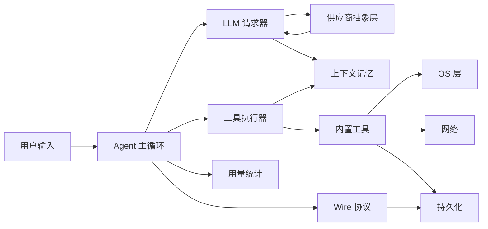

# agent-core-v2 架构总览

```mermaid
%%{init: {'theme': 'base', 'themeVariables': { 'fontSize': '13px'}}}%%
flowchart TB
    subgraph infra["基础设施层 src/_base/"]
        DI["DI 容器<br/>InstantiationService"]
        Lifecycle["生命周期管理<br/>Disposable / LifecycleScope"]
        Log["日志服务<br/>ILogService"]
        Utils["工具函数"]
        State["状态管理"]
    end

    subgraph cross["跨层基础设施"]
        Wire["Wire 协议层<br/>src/wire/"]
        Kosong["LLM 供应商抽象层<br/>src/kosong/"]
        OS["OS 抽象层<br/>src/os/"]
        Persist["持久化抽象层<br/>src/persistence/"]
    end

    subgraph app["App 域 — 进程级单例 (LifecycleScope.App)"]
        Config["配置管理<br/>configService"]
        Auth["认证<br/>authService"]
        Plugin["插件系统<br/>pluginService"]
        SkillCat["Skill 目录<br/>skillCatalog"]
        AgentFile["Agent 文件目录<br/>agentFileCatalog"]
        Workspace["工作区<br/>workspaceService"]
        SessionIdx["Session 索引<br/>sessionIndex"]
        SessionLC["Session 生命周期<br/>sessionLifecycle"]
        Telemetry["遥测<br/>telemetryService"]
        Flag["功能开关<br/>flagService"]
        Gateway["网关<br/>gatewayService"]
        Bootstrap["启动引导<br/>bootstrapService"]
        KosongCfg["模型配置<br/>kosongConfigService"]
        Event["事件总线<br/>eventBusService"]
        Task["后台任务<br/>taskService"]
        FileSvc["文件服务<br/>fileService"]
        HostFolder["主机目录浏览<br/>hostFolderBrowser"]
        Git["Git 集成<br/>gitService"]
    end

    subgraph session["Session 域 — 每个会话一份 (LifecycleScope.Session)"]
        SMeta["Session 元数据<br/>sessionMetadata"]
        SInit["Session 初始化<br/>sessionInit"]
        SLife["Agent 生命周期<br/>agentLifecycle"]
        SApproval["审批流<br/>approval"]
        SInteraction["交互请求<br/>interaction"]
        SQuestion["用户提问<br/>question"]
        MCP["MCP 协议<br/>sessionMcp"]
        SAgentCat["Agent 配置目录<br/>sessionAgentProfileCatalog"]
        SSkillCat["Skill 目录<br/>sessionSkillCatalog"]
        SToolPolicy["Tool 策略<br/>sessionToolPolicy"]
        SActivity["活动视图<br/>sessionActivity"]
        SGoalQ["目标队列<br/>goalQueue"]
        SSubagent["子 Agent<br/>subagent"]
        SSwarm["Agent Swarm<br/>sessionSwarm"]
        STodo["Todo 管理<br/>sessionTodo"]
        STerminal["终端<br/>terminal"]
        SProcess["进程管理<br/>process"]
        SCron["定时任务<br/>sessionCron"]
        SExTeam["专家团队<br/>expertTeam"]
        SWsCmd["工作区命令<br/>workspaceCommand"]
        SWsCtx["工作区上下文<br/>workspaceContext"]
    end

    subgraph agent["Agent 域 — 每个 Agent 一份 (LifecycleScope.Agent)"]
        Loop["Agent 主循环<br/>agentLoop"]
        LLM["LLM 请求器<br/>llmRequester"]
        CtxMem["上下文记忆<br/>contextMemory"]
        CtxSize["上下文大小管理<br/>contextSize"]
        CtxProj["上下文投影<br/>contextProjector"]
        CtxInject["上下文注入<br/>contextInjector"]

        subgraph tools["工具系统"]
            ToolReg["工具注册中心<br/>toolRegistry"]
            ToolSel["工具选择<br/>toolSelect"]
            ToolExec["工具执行器<br/>toolExecutor"]
            ToolApproval2["工具审批<br/>toolApproval"]
            ToolAct["工具激活<br/>toolActivation"]
            ToolPolicy["工具策略<br/>toolPolicy"]
            ToolDedupe["工具去重<br/>toolDedupe"]
        end

        subgraph builtin["内置工具集"]
            ToolAgent["agent 子Agent"]
            ToolSwarm["agent-swarm"]
            ToolAsk["ask-user-question"]
            ToolCron["cron"]
            ToolEdit["edit"]
            ToolSkill["skill"]
            ToolOS["OS 工具集<br/>bash/glob/grep/read/write"]
            ToolWeb["web-search"]
            ToolFetch["fetch-url"]
            ToolGoal["goal 目标管理"]
            ToolPlan["plan 计划模式"]
            ToolTask["task 任务管理"]
            ToolTodo["todo-list"]
            ToolReadMedia["read-media-file"]
            ToolSelectTools["select-tools"]
        end

        PermGate["权限门<br/>permissionGate"]
        PermMode["权限模式<br/>permissionMode"]
        PermPolicy["权限策略<br/>permissionPolicy"]
        PermRules["权限规则<br/>permissionRules"]
        Profile["Agent 配置<br/>profile"]
        Prompt["提示词<br/>prompt"]
        Plan["计划模式<br/>plan"]
        Goal["目标模式<br/>goal"]
        Swarm["Agent 编排<br/>swarm"]
        TaskMgr["任务管理<br/>task"]
        SkillExec["Skill 执行<br/>skill"]
        Undo["撤销<br/>undo"]
        Usage["用量统计<br/>usage"]
        Media["媒体处理<br/>media"]
        ShellCmd["Shell 命令<br/>shellCommand"]
        RPC["RPC<br/>rpc"]
        ScopeCtx["作用域上下文<br/>scopeContext"]
        StepRetry["步骤重试<br/>stepRetry"]
        SystemRM["系统提示<br/>systemReminder"]
        FullComp["上下文压缩<br/>fullCompaction"]
        PluginAgent["Agent 插件<br/>plugin"]
        ExtAgent["Agent 扩展<br/>extension"]
        FaultInject["故障注入<br/>faultInjection"]
        ActivityView["活动视图<br/>activityView"]
        ReplayView["回放视图<br/>replayView"]
        Blob["二进制数据<br/>blob"]
    end

    subgraph tools_collect["Agent Tools 内置工具"]
        direction TB
        TOOS["OS 工具集<br/>bash / glob / grep<br/>read / write"]
        TOEdit["edit"]
        TOSkill["skill"]
        TOAgent["agent / agent-swarm"]
        TOQuestion["ask-user-question"]
        TOCron["cron / cron-list<br/>cron-create / cron-delete"]
        TOFetch["fetch-url"]
        TOWeb["web-search"]
        TOGoal["goal / get-goal<br/>set-goal-budget / update-goal"]
        TOPlan["enter-plan-mode<br/>exit-plan-mode"]
        TOTask["task / task-list<br/>task-output / task-stop"]
        TOTodo["todo-list"]
        TORead["read-media-file"]
        TOSel["select-tools"]
    end

    %% 跨层依赖关系
    DI --> Lifecycle
    DI --> Log

    %% App 域依赖基础设施
    Config --> DI
    Config --> Log
    Auth --> Config
    Plugin --> Config
    KosongCfg --> Config

    %% Session 域依赖关系
    SInit --> Config
    SInit --> SMeta
    SLife --> SInit
    SInit --> SApproval
    SInit --> SInteraction

    %% Agent 域依赖关系 — 主循环是核心
    Loop --> LLM
    Loop --> CtxMem
    Loop --> ToolExec
    Loop --> PermGate
    Loop --> Usage
    Loop --> StepRetry
    Loop --> FullComp
    LLM --> Kosong
    ToolExec --> ToolReg
    ToolExec --> ToolApproval2
    ToolExec --> ToolDedupe
    ToolExec --> CtxMem
    CtxMem --> Wire
    CtxSize --> CtxMem
    CtxProj --> CtxMem
    CtxInject --> CtxMem

    %% Scope 父子关系
    AppScope["App Scope 容器"] --> SessionScope["Session Scope 容器"]
    SessionScope --> AgentScope["Agent Scope 容器"]

    AppScope -.->|"子 scope 向上可见"| SessionScope
    SessionScope -.->|"子 scope 向上可见"| AgentScope
```



## 三层生命周期架构

agent-core-v2 的核心是 **DI × Scope** 架构：服务按三层生命周期注册，容器自动管理创建、注入和销毁。

```
App (0) — 进程级单例
  └── Session (1) — 每个对话一个实例
       └── Agent (2) — 每个 Agent 一个实例
```

**可见性规则**：子 scope 可以注入父 scope 的服务（Agent → Session → App 向上查找），反之不行。

## 核心数据流



## DI 注册机制

- **无中心装配文件**：每个域在实现文件顶层调用 `registerScopedService(scope, IX, Impl, activation, domain)`
- 通过 barrel `index.ts` 和包入口 `src/index.ts` 的 `export *` 收集所有注册
- 两种激活时机：`OnScopeCreated`（随 scope 创建）和 `OnDemand`（首次 get() 时）

## 依赖注入核心接口

| 接口 | 用途 |
|---|---|
| `createDecorator<T>(name)` | 创建服务身份（运行时 key + 编译时类型 + 参数装饰器） |
| `@IService` | 在构造器参数上声明依赖 |
| `ServicesAccessor.get(IX)` | 按接口解析实例 |
| `invokeFunction(fn)` | 在函数中临时获取 accessor |
| `createInstance(ctor, ...args)` | 创建非单例对象并注入依赖 |
| `createChild(collection)` | 派生子容器 |
